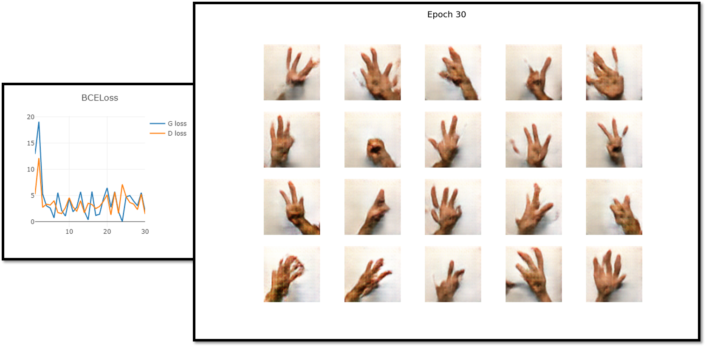

# PyTorch DCGAN
- 파이토치 Deep Convolutional Generative Adversarial Network
___
### 프로그램 실행 방법
- 학습
  - python -m visdom.server 실행
  - python Main/run_train.py 실행
- 테스트
  - python Main/run_test.py 실행
---
### 프로그램 기능
- 학습 및 테스트
- 모델 파일 저장 및 불러오기
- 학습 진행 과정 그래프로 시각화
- 학습 결과물 이미지로 저장
---
### 프로그램 구조
- Main/run_train.py 및 Main/run_test.py 에서 디바이스, 모델, optimizer, dataloader, 손실 함수, metric 등 모두 선언 및 실행
- Main/run_test.py 에서는 이미지 생성을 위해 noise z 를 함께 선언해주어야 함. (학습된 생성자 모델을 사용하여 이미지를 생성하는 것은 필요에 따라 직접 구현해서 사용할 것.)
---
### 실행 결과물
- Training progress

    

---
### 참조
https://github.com/MV-CuttingEdgeAI/YHKim-DeepLearningStudy
