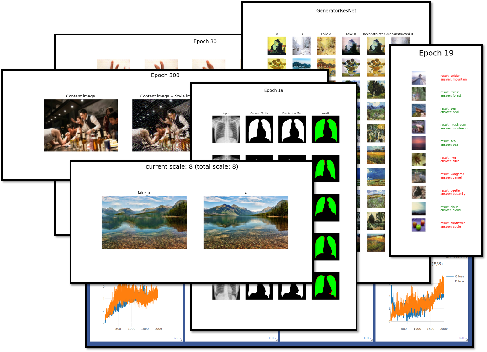

# PyTorch basic model implementation

You can try training and testing simple deep learning models!

    

---
### Implemented models
- Image Classification
  - VGGNet
  - InceptionNet
  - ResNet
- Image Segmentation
  - FCN
  - U-Net
- Image Generation
  - neural style transfer
  - DCGAN
  - pix2pix
  - CycleGAN
  - SinGAN
