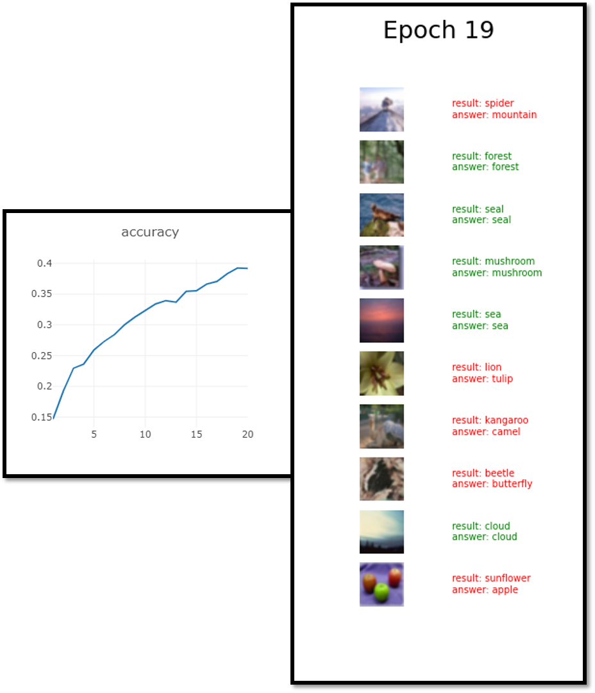

# PyTorch ResNet
- 파이토치 Deep Residual Learning for Image Recognition
___
### 프로그램 실행 방법
- 학습
  - python -m visdom.server 실행
  - python Main/run_train.py 실행
- 테스트
  - python Main/run_test.py 실행
---
### 프로그램 기능
- 학습 및 테스트
- 모델 파일 저장 및 불러오기
- 학습 진행 과정 그래프로 시각화
---
### 프로그램 구조
- Main/run_train.py 및 Main/run_test.py 에서 디바이스, 모델, optimizer, dataloader, 손실 함수, metric 등 모두 선언 및 실행
- DeepLearning/layer.py 에 모델을 구성하기 위한 nn.Module 들을 미리 만들어 놓고 DeepLearning/model.py 에서 모델을 구성하는데 사용
- 모델 선언은 DeepLearning/model.py 에서 미리 선언되어 있는 모델들중에서 가져올 것. (resnet18, resnet50)
---
### 실행 결과물
- Training progress

    

---
### 참조
https://github.com/MV-CuttingEdgeAI/YHKim-DeepLearningStudy
