# PyTorch SinGAN
- 파이토치 SinGAN: Learning a Generative Model from a Single Natural Image
___
### 프로그램 실행 방법
- 학습
  - python -m visdom.server 실행
  - python Main/run_train.py 실행
- 테스트
  - python Main/run_test.py 실행
---
### 프로그램 기능
- 학습 및 테스트
- 모델 파일 저장 및 불러오기
- 학습 진행 과정 그래프로 시각화
- 학습 결과물 이미지로 저장
---
### 프로그램 구조
- Main/run_train.py 및 Main/run_test.py 에서 디바이스, 이미지 피라미드, 모델, optimizer, 손실 함수, metric 등 모두 선언 및 실행
- DeepLearning/layer.py 에 모델을 구성하기 위한 nn.Module 들을 미리 만들어 놓고 DeepLearning/model.py 에서 모델을 구성하는데 사용
- SinGAN 의 경우 scale 에 따른 여러 모델을 쌓아 올리는 형태로 Main/run_train.py 및 Main/run_test.py 에서 모델을 scale 마다 호출하여 전체 모델 구성 및 대응하는 optimizer 또한 scale 마다 선언
---
### 실행 결과물
- Training progress

| 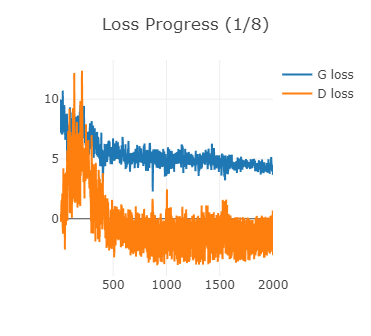  | 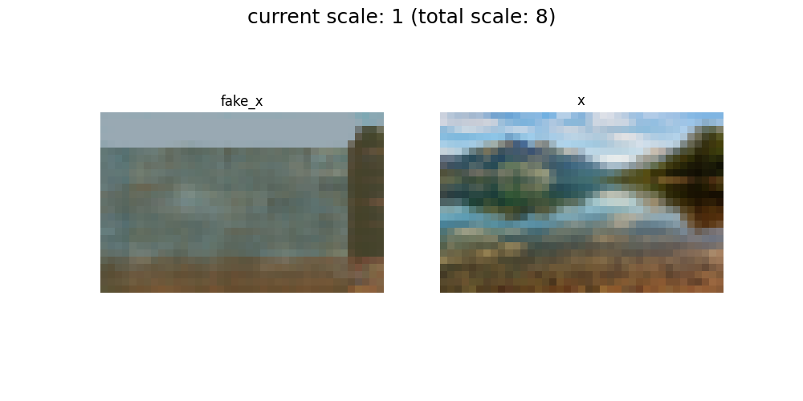  |
|--------------------|--------------------|
| 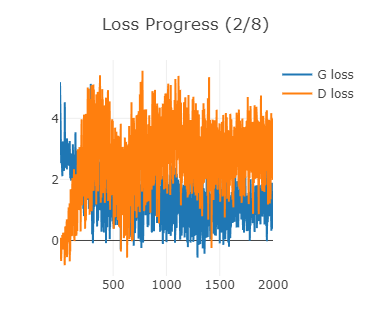  | 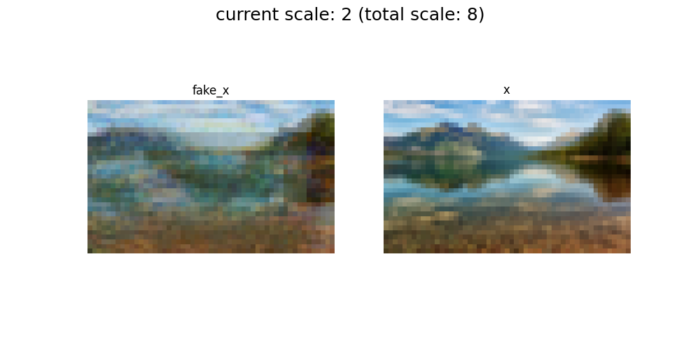  |
| 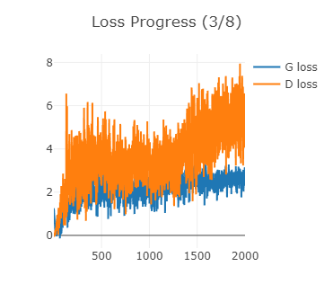  | 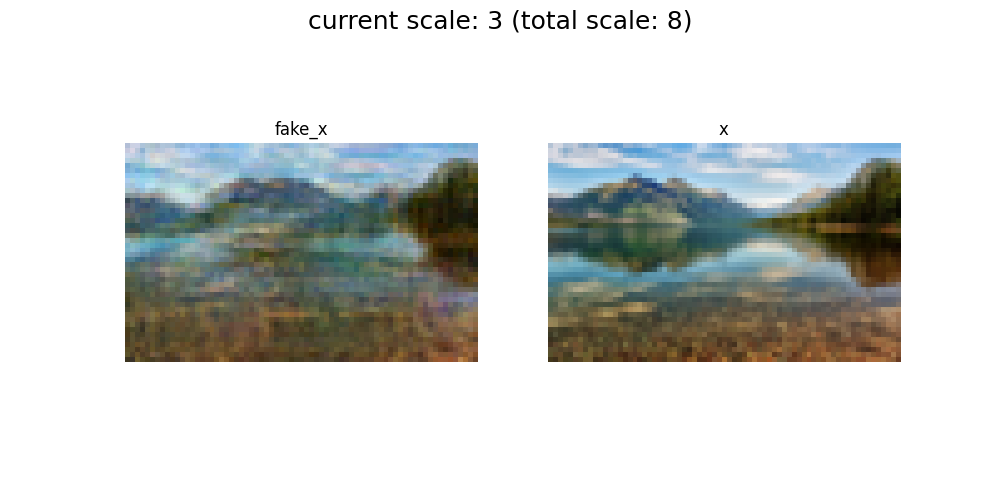  |
| 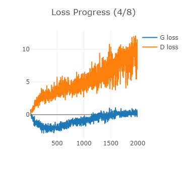  | 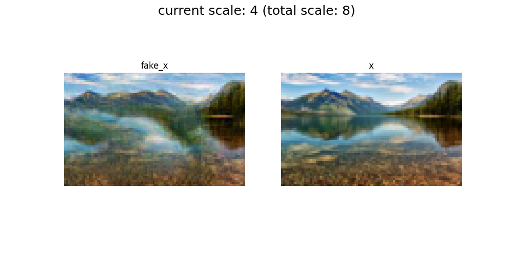  |
| 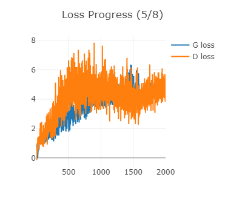  | 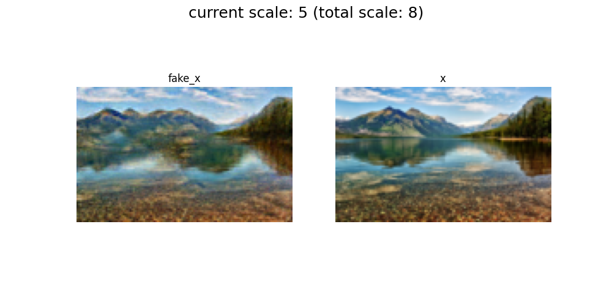 |
| 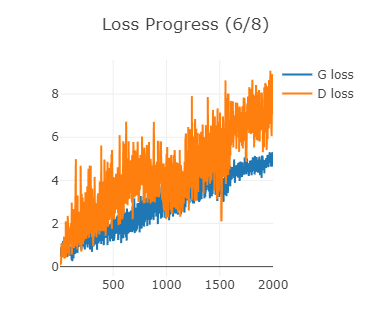 | 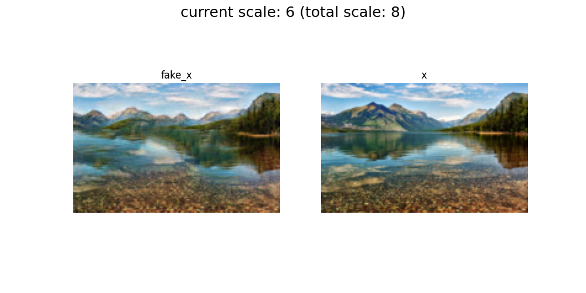 |
| 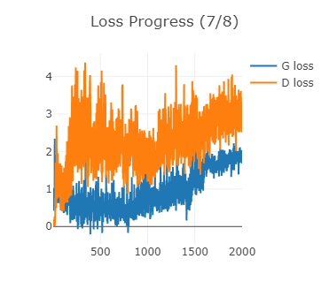 | 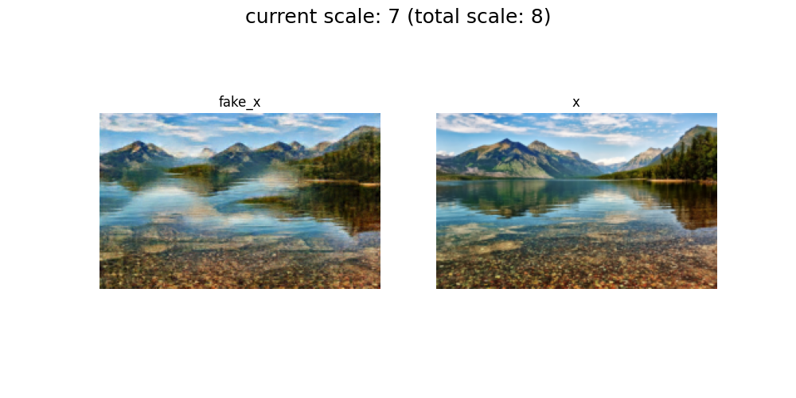 |
| 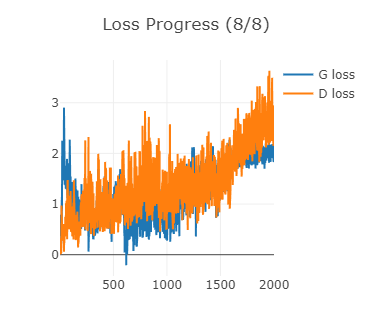 | 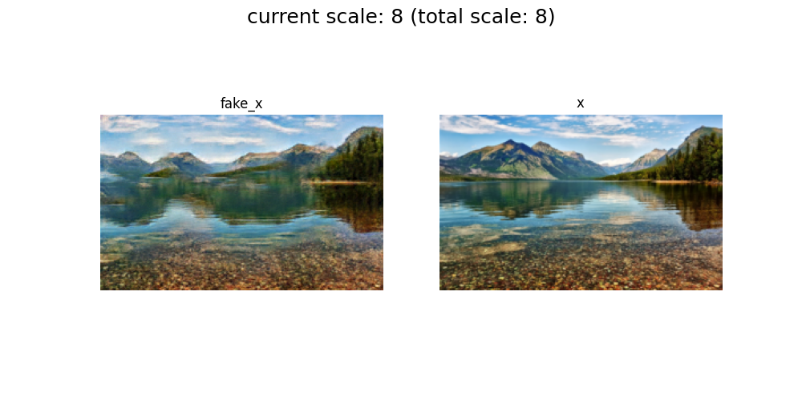 |
---
### 참조
https://github.com/MV-CuttingEdgeAI/YHKim-DeepLearningStudy
