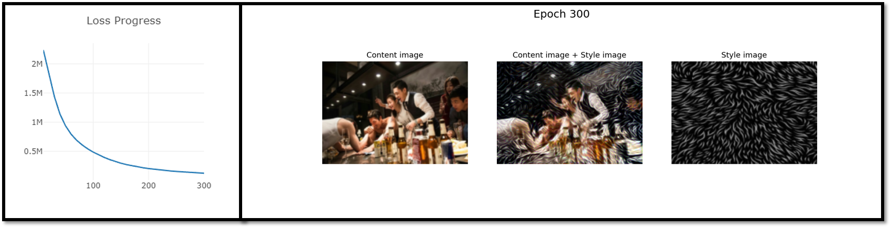

# PyTorch Neural Style Transfer
- 파이토치 A Neural Algorithm of Artistic Style
___
### 프로그램 실행 방법
- 학습
  - python -m visdom.server 실행
  - python Main/run_train.py 실행
- 테스트
  - python Main/run_test.py 실행
---
### 프로그램 기능
- 학습 및 테스트
- 모델 파일 저장 및 불러오기
- 학습 진행 과정 그래프로 시각화
---
### 프로그램 구조
- Main/run_train.py 및 Main/run_test.py 에서 디바이스, 모델, optimizer, dataloader, 손실 함수, metric 등 모두 선언 및 실행
- 이번에는 모델을 학습시키는 것이 아닌 이미지 데이터 자체를 변형시키는 과정
- VGG-19 의 features 를 사용해 intermediate output values 를 이용한 학습 진행
---
### 실행 결과물
- Training progress

    

---
### 참조
https://github.com/MV-CuttingEdgeAI/YHKim-DeepLearningStudy
